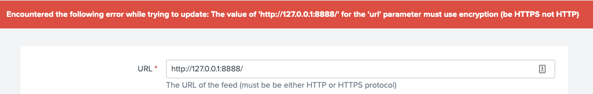
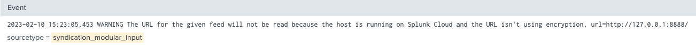

# splunk-syndication-input
A Splunk app for reading syndication feeds (RSS, ATOM, RDF)

I support this app in my free-time and at my own expense. Please consider offering a donation in order to promote continued development. [You can donate on Paypal.](https://www.paypal.com/donate?business=MQSKTS3W7LUTY&item_name=Support+continued+development+of+Splunk+apps&currency_code=USD)


# Cloud Support

This app will require feeds to use SSL (HTTPS) is installed in a Splunk Cloud environment.

## How SSL Support is Enforced

The app ensures that feeds us HTTPs on Cloud in two ways:

### 1. UI blocks the creation of inputs if they don't use SSL

The UI will reject an input that uses HTTP if on cloud. An attempt to create an input with HTTP will cause the page to generate the following error:



This is enforced in the modular input code by specifying setting `require_https_on_cloud` to `True` (see src/bin/syndication.py):

```
URLField("url", "Feed URL", "The URL of the feed to input", empty_allowed=False, require_https_on_cloud=True),
```

The URLField comes from the [modular_input library](https://github.com/LukeMurphey/splunk-modular-input) that I wrote. The URLField and its validation routine can be see in https://github.com/LukeMurphey/splunk-modular-input/blob/master/src/fields.py. 

### 2. Modular input identifies non-SSL inputs and blocks execution

The UI ought to reject the creation of any inputs that use SSL. However, the modular input in this app will also reject inputs even if somehow the user got past the error (like installing an app that includes a feed input that used a non-SSL feed). See the line in src/bin/syndication.py which will block execution if the input is not SSL:

```
# Don't scan the URL if the URL is unencrypted and the host is on Cloud
if self.is_on_cloud(input_config.session_key) and not feed_url.scheme == "https":
   self.logger.warn("The URL for the given feed will not be read because the host is running on Splunk Cloud and the URL isn't using encryption, url=%s", feed_url.geturl())
```

This will generate a warning in the log and loading of the feed will not continue:



## Testing the cloud restrictions

One of the best ways to test the cloud restrictions is to deploy a local instance of Splunk and set the instance-type to cloud by putting the following in `$SPLUNK_HOME/etc/system/local/server.conf`:

```
[general]
instanceType = cloud
```
